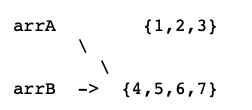
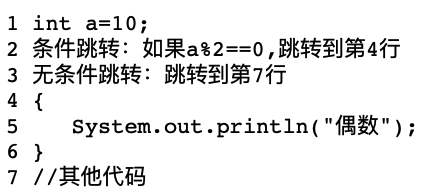
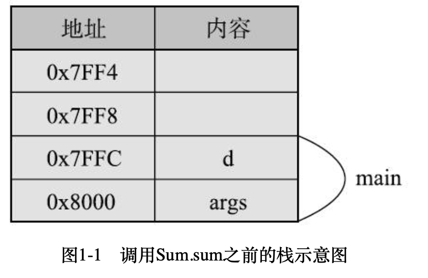

/*
 * Created 2024-05-04 12:45:57
 * Author : fengxuegt
 * Email : fengxuegt@163.com
 */

## 1.1 数据类型和变量
整数类型：byte short int long
小数类型：float double
其他类型：char boolean

变量就是给数据起名字，方便查找不同的数据，值是可以变的

## 1.2 赋值
整数四种数据类型字节大小分别是1、2、4、8

数字常量默认是int类型，所以给long类型变量赋值要加L
小数默认是double类型，因此给float变量赋值要加F

### 1.2.2 数组类型
三种赋值形式：
```java
int [] arr = {1, 2, 3};
int [] arr = new int[] {1, 2, 3};
int [] arr = new int []; // 分配时会有默认值，默认值和数据类型有关，数值类型为0，boolean为false，char为空字符
arr[0] = 1;
arr[1] = 2;
arr[2] = 3;

int arr[] = new int[3]{1, 2,3}; // 这种写法是错误的，因为两个地方给了长度，如果不一致计算机不知道如何处理
```
数组类型变量中存储的是地址，地址引用到真实的数据；因此在做数组变量赋值时，改变的是地址值；



## 1.3 基本运算
### 1.3.1 算数运算
基本算数运算包括加减乘除、取模、++、--
取模只能适用于整数和char
其他运算数值类型和char都适用

**加减乘除注意点**
两个小类型数据相乘可能会发生溢出，因此需要使用适当的数据类型来存储数据；

整数相除不是四舍五入，而是截断；
如果要算小数，则必须有个操作数为小数；

**小数计算结果并不精确**

**自增和自减**
注意先算自己还是后算自己即可

### 1.3.2 比较运算
```shell
> >= < <= == !=
```
注意==判断的是比较地址即可

### 1.3.2 逻辑运算
逻辑运算只可应用于boolean类型变量;
& and && 类似；
| and || 也类似；
只是后者多了短路；
也可用于位运算；
那其实应该是如果是boolean类型那就是逻辑运算，如果是数值类型那就是位运算；

### 1.3.3 位运算
Java中的位运算不常用，但是还是有用的；只能应用于整数类型和字符类型

```
& | ~ << >> >>> ^
```
`>>>`是无符号右移动，左边补0；
`>>`是算数右移动，左边补符号位；

## 1.4 条件执行
switch的case数据类型可以是byte、short、int、枚举、string、char

### 1.4.2 实现原理
**条件跳转和无条件跳转**


上述代码转换成汇编指令之后会插入条件跳转指令和无条件跳转指令



**没有第三行的无条件跳转指令可不可以？** 不行，因为没有他的话，大括号里的代码都会执行；
但是也有可能是另一种指令


这种就没有无条件跳转指令，生成何种指令是由编译器决定的；

**跳转表**
switch的转换和具体系统实现有关，如果分支较少，那么可能会转换成条件指令，但是分支较多时，使用条件跳转会进行多次的比较运算，效率比较低，因此使用跳转表。跳转表是映射表，存储了需要跳转到的位置；


跳转表为何效率更高呢？
因为表中的值必须为整数，且按照大小顺序排序。排序之后可以按照二分查找进行查找；如果值是连续的，或者比较稠密，编译器甚至会优化为一个数组，case的值就是数组的下标。
效率更高；
switch源代码中的case并不要求排序，但是编译器会自动排序。case表达式的数据类型都可以进行排序，不能用long的原因是跳转表的值存储空间一般为32位，存不下long。

string的话是用的他的hashcode函数生成一个值；根据值跳转之后还要比较内容；

简单总结下就是条件执行的本质是通过条件跳转指令和无条件跳转指令和跳转表实现的。

## 1.5 循环
### 1.5.1 循环的四种形式
**while**
while（语句）
{
    代码
}

**注意**
如果scanner在等待输入，则无法打印sout的语句；

**do while**
无论什么情况，都会执行一次；

**for**
括号中的语句可以省略，但是分号不能省略；

**foreach**
foreach并不是一个关键字，使用：；只是简单遍历的话foreach更方便；

### 1.5.2 循环控制
**break**
跳出循环；并且不会执行i++语句；注意后者；

**continue**
跳过本次循环

### 1.5.3 实现原理
和if一样，循环内部也是通过条件转移指令和无条件转移指令实现的；
举个例子，
```java
int [] arr = {1, 2, 3, 4};
for (int i = 0; i < arr.length; i++) {
    System.out.println(arr[i]);
}
```
编译之后的指令如下
```java
1 int [] arr = {1, 2, 3, 4};
2 int i = 0;
3 条件跳转：如果i >= arr.length 跳转到第七行；
4 System.out.println(arr[i]);
5 i++;
6 无条件跳转第三行
7 其他代码
```

## 1.6 函数的用法
### 1.6.1 基本概念
```java
int a = 23;
System.out.println(Integer.toBinaryString(a));
```
toBinaryString 是Integer类的public static函数，输出一个数字的二进制表示；

### 1.6.2 进一步理解函数
**参数传递**
数组作为参数传递，在函数内部修改数组会对调用者中的数组内容；值传递，传递的是数组的地址；

**可变长参数**
- 语法是数据类型之后跟着三个小点(中间有无空格均可)，在函数内部，可变长参数可以看做是数组。可变长参数必须是参数的最后一个，并且一个函数只能有一个可变长参数；
- 可变长参数实际上会转换成数组参数；例如max(int min, int ... a) 实际上会转换为max(int min, int a[]);在调用max(0,1,2,3)时会转换成max(0, new int[]{1, 2, 3,});

**理解返回**
return 可以在函数的任意地方；同时只能返回一个值，但是这个值可以是数组和对象；

**重复的命名**
函数重载

**调用的匹配过程**
编译器会自动寻找最匹配的函数进行调用；
参数只要能够进行类型转换，那么就能够调用；无论是不是有重载；

**递归函数**
略

## 1.7 函数调用的基本原理
### 1.7.1 栈的概念
栈是一块内存，但是它的使用有特别的约定，一般是先进后出，类似于一个桶。栈一般是由高地址向低地址扩展。一般使用栈来保存函数调用过程中的数据；
包括参数、返回地址、以及函数内部的各种局部变量。

返回值不太一样，我们可以理解成返回值有专门的存储器；main函数相关的数据放在栈的最下面。

### 1.7.2 函数执行的基本原理
引用图中的实例图：
```java
public class Sum {
    public static int sum(int a, int b) {
        int c = a + b; 
        return c;
    }

    public static void main(String args[]) {
        int d = Sum.sum(1, 2);
        System.out.println(d);
    }
}
```
sum函数调用之前，栈中只有main函数的信息；



调用之后；


main函数调用sum函数时，首先将1和2入栈，然后将返回地址（也就是函数调用结束后要执行的命令地址）入栈，接着跳转到sum函数的指令，在sum函数内部，需要为局部变量c分配内存；
**注意**
看样子地址是在形参入栈之后才压栈的；

### 1.7.5 小结
函数调用主要是通过栈来存储相关的数据，系统就函数调用者和函数如何使用栈做了约定，返回值可以简单认为是通过一个专门的返回值存储器存储的；
